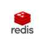
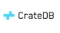

# Databases

*The tables below are not precise. The pricing and hosting columns are based on a quick research. Most often there is a price option of 0$ if hosted on premise. The prices in the tables are taken from the cloud platforms that provide the database*

|Icon|Name|Price|Highlighted attributes|Hosting||
|---|---|---|---|---|---|
||MySQL|4$/month, |Open-source, cross-platform, scalable, multiple storage engines.|Most cloud platforms, on-premise|[read more](https://www.mysql.com/)|
||Microsoft sql server|5$/month|Comprehensive, T-SQL, high scalability, Azure integration.|Most cloud platforms, on-premise|[read more](https://learn.microsoft.com/en-us/sql/sql-server/what-is-sql-server?view=sql-server-ver16)|
||Supabase (Postgres)|Free tier, 25$/month|Open-source, PostgreSQL-based, real-time, developer-friendly.|Supabase|[read more](https://supabase.com/)|||
||IBM Db2|Free tier(sandbox), 99$/month|Enterprise-grade, multi-workload, AI integration, cross-platform.|IBM, AWS|[read more](https://www.ibm.com/products/db2)|
||SQLite|3$/month|Embedded, zero configuration, widely deployed, ACID-compliant.|Most cloud platfroms, on-premise|[read more](https://www.sqlite.org/)|
||MariaDB|3$/month|MySQL fork, feature-rich, highly compatible, community-driven.|Many cloud platforms, on-premise|[read more](https://mariadb.org/)|
||Chroma|Free tier|Not widely known, Vector database, ML.|on-premise|[read more](https://www.trychroma.com/)|
||Marqo|43$/month| Open source, tensor search, AI-focused, Elasticsearch-compatible.|Marqo cloud|[read more](https://www.marqo.ai/)|
||ScyllaDB|20$/month|High performance, low latency, Cassandra-compatible, scalable.|GCP, AWS|[read more](https://www.scylladb.com/)|
||Redis|5$/month|In-memory, key-value store, high performance, pub/sub.|Redis cloud, on-premise|[read more](https://redis.com/)|
||Aerospike||Real-time, NoSQL, high scalability, flash-optimized.||[read more](https://aerospike.com/)|
||GemStone/S||Object database, Smalltalk integration, scalable, multi-user.||[read more]()|
||ZODB|Free tier|Python, object-oriented database, transactional, ACID properties.|on-premise|[read more](https://zodb.org/en/latest/)|
||MongoDB|Free tier, 57$/month|Document-oriented, high performance, scalable, JSON-like queries.|Cloud|[read more](https://www.mongodb.com/)|
||Firestore|Free tier|NoSQL, real-time, cloud-native, scalable, Firebase integration.|GCP|[read more](https://firebase.google.com/)|
||CrateDB|Free tier|Distributed SQL, real-time analytics, scalable, IoT optimized.|CrateDB cloud, on-premise|[read more](https://cratedb.com/)|
||Apache HBASE|Free tier|Column-oriented, scalable, distributed, BigTable model, Hadoop integration.|on-premise|[read more](https://hbase.apache.org/)|
||SurrealDB|Free tier|New SQL, real-time, multi-model, JSON document store.|on-premise|[read more](https://surrealdb.com/)|
||ArangoDB|Free tier|Multi-model, graph, document, key/value, ACID transactions.||Cloud, on-premise[read more](https://arangodb.com/)|
||Neo4j|Free tier, 65$/month|Graph database, high-performance, relationships-focused, ACID-compliant.|Neo4J cloud, on-premise|[read more](https://neo4j.com/)|

https://www.predictiveanalyticstoday.com/top-nosql-document-databases/
https://www.predictiveanalyticstoday.com/top-object-databases/
https://en.wikipedia.org/wiki/Graph_database  