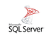

# Databases

*The tables below are not precise. The pricing and hosting columns are based on a quick research. Most often there is a price option of 0$ if hosted on premise. The prices in the tables are taken from the cloud platforms that provide the database*

## SQL Databases
### Relational databases
|Icon|Name|Price|Highlighted attributes|Hosting||
|---|---|---|---|---|---|
||MySQL|4$/month, ||Most cloud platforms, on-premise|[read more](https://www.mysql.com/)|
||Microsoft sql server|5$/month||Most cloud platforms, on-premise|[read more](https://learn.microsoft.com/en-us/sql/sql-server/what-is-sql-server?view=sql-server-ver16)|
||Supabase (Postgres)|Free tier, 25$/month||Supabase|[read more](https://supabase.com/)|||
||IBM Db2|Free tier(sandbox), 99$/month||IBM, AWS|[read more](https://www.ibm.com/products/db2)|
||SQLite|3$/month||Most cloud platfroms, on-premise|[read more](https://www.sqlite.org/)|
||MariaDB|3$/month||Many cloud platforms, on-premise|[read more](https://mariadb.org/)|

## NoSQL Databases
|Type|Icon|Name|Price|Highlighted attributes|Hosting||
|---|---|---|---|---|---|---|
|Vector||||||[read more]()|
|Key-value store||||||[read more]()|
|Tuple store||||||[read more]()|
|Triplestore||||||[read more]()|
|Object database||||||[read more]()|
|Document store||||||[read more]()|
|Wide-columns store||||||[read more]()|
|Native multi-model database||||||[read more]()|
|Graph database||||||[read more]()|
|Multivalue database||||||[read more]()|